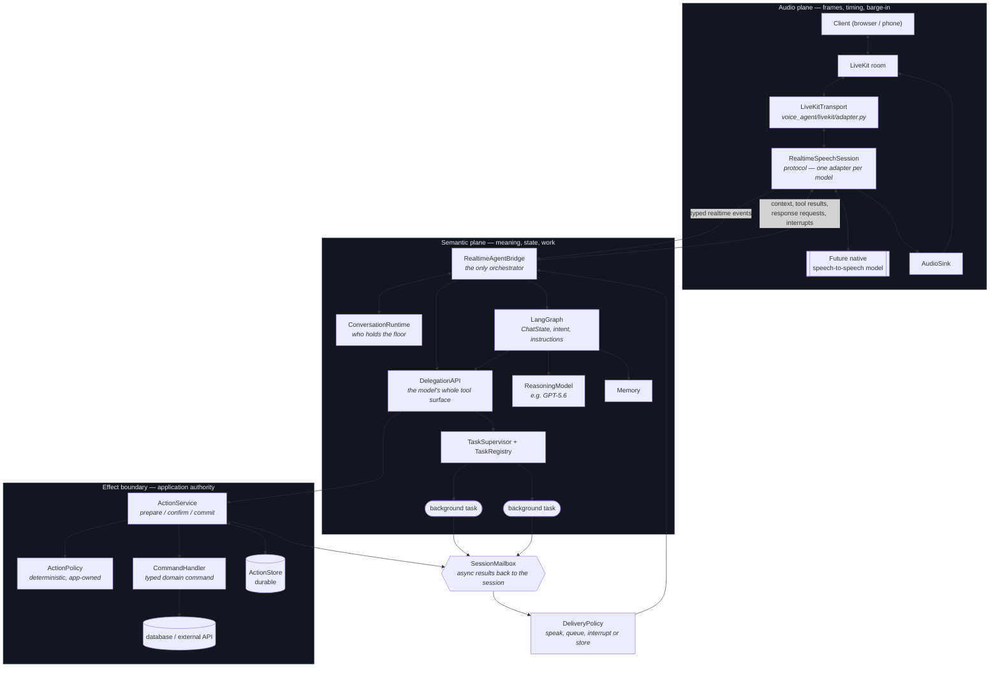
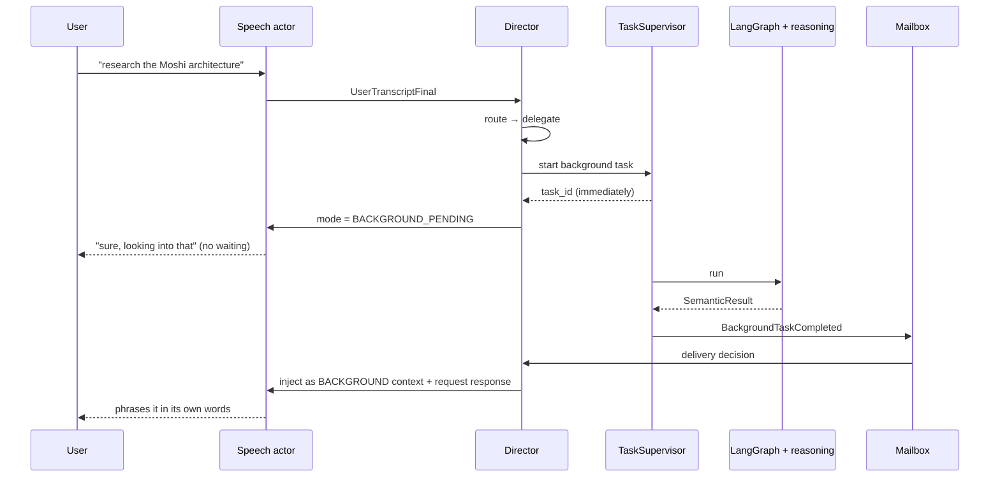
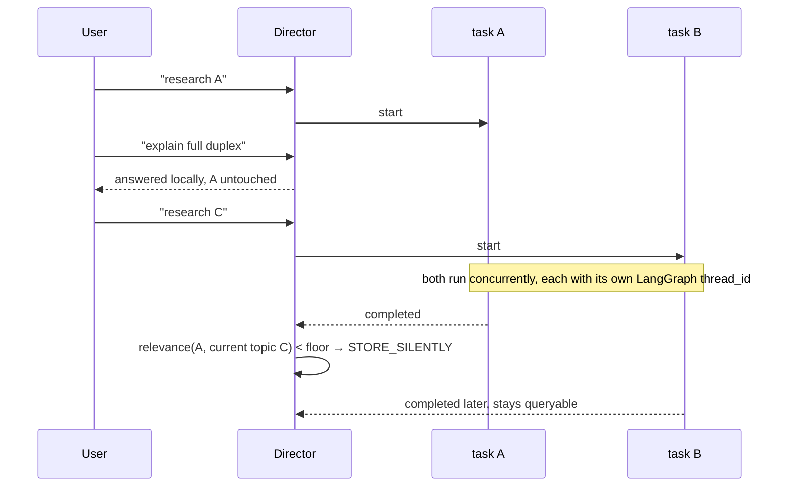
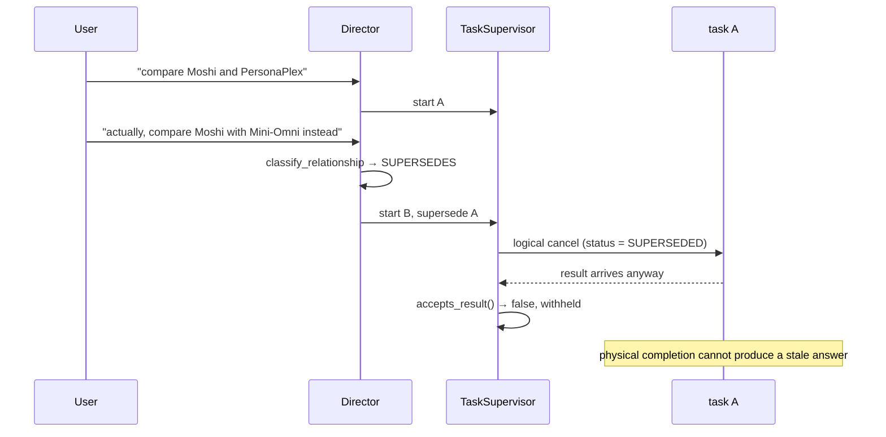
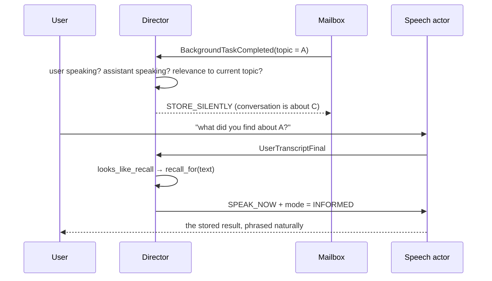

# Realtime voice agent architecture

The system is built around one rule: **the audio plane and the semantic plane are separate.**

Audio never reaches LangGraph. Business logic never reaches the speech model. The two meet only in
`RealtimeAgentBridge`, which is the single place orchestration lives.

## Where the code lives

| Path | What it is |
| --- | --- |
| `voice_agent/session.py` | `ConversationSession`, which wires one conversation together |
| `voice_agent/correlation.py` | the identity every event on both planes carries |
| `voice_agent/realtime/` | the audio plane: `events`, the `RealtimeSpeechSession` protocol (`session`), `audio` sinks, `capabilities`, the `bridge` to the semantic plane, the scriptable `fake`, and the `qwen/` adapter |
| `voice_agent/livekit/adapter.py` | the LiveKit transport |
| `voice_agent/agent/events.py` | semantic events (task started, completed, superseded, action awaiting confirmation, ...) |
| `voice_agent/agent/delegation.py` | `DelegationAPI`, the whole surface the speech model may touch |
| `voice_agent/agent/conversation/` | the per-utterance decisions: `director`, `routing`, `speech_policy`, `runtime` |
| `voice_agent/agent/tasks/` | background work: `models`, `registry`, `supervisor`, and the `results` a worker returns |
| `voice_agent/agent/delivery/` | what happens when a result arrives (`policy`) and the `mailbox` back to the session |
| `voice_agent/agent/actions/` | side effects: commands, policy, `ActionService`, store, audit |
| `voice_agent/demo.py` | `uv run python -m voice_agent.demo`, the whole flow against the fake session |

The diagrams below draw the semantic plane as LangGraph with a `ChatState` and a separate
`ReasoningModel`. That graph (`agent/graph.py`, with `agent/state.py`, `agent/reasoning.py` and an
`agent/memory.py` long-term store) was never wired into `ConversationSession`, and was removed with the
unused `storage/repositories.py`; the semantic decisions run in `ConversationDirector`, and background
work is whatever runner the `TaskSupervisor` is given. The diagrams still show where a graph would plug in.
With them went the prompts that only an LLM router and a reasoning worker would have read
(`ROUTER_PROMPT`, `BACKGROUND_REASONING_PROMPT`), `SemanticResult.from_payload`, the unused
`COMPATIBILITY_PIPELINE` capability profile and `RealtimeCommand` alias, and counters nothing read.

## Who owns what

| Component | Owns | Must never |
| --- | --- | --- |
| `RealtimeSpeechSession` | the duplex connection, spoken output, conversational timing | execute business logic or tools |
| `LiveKitTransport` | frames, room and participant lifecycle | contain orchestration |
| `RealtimeAgentBridge` | normalising events, routing tools, applying delivery decisions | perform effects itself |
| `ConversationRuntime` | who is speaking, current turn, epoch, idempotency sets | hold semantic history |
| LangGraph | semantic state, intent, task orchestration, instructions | see an audio frame |
| `TaskSupervisor` | every background asyncio task | outlive the session silently |
| `ActionService` | prepare/confirm/commit, idempotency, audit | trust model arguments at commit |
| `ReasoningModel` | planning, synthesis, verification | be the speech model |

## The conversation layer

`ConversationDirector` sits above the bridge and makes the semantic decisions: delegate or answer
locally, extend or supersede, surface a stored result or hold it. It is separate from the bridge
because none of those belong in transport callbacks.

| Component | Question it answers |
| --- | --- |
| `SemanticRouter` (`agent/conversation/routing.py`) | local, delegate, or wait for more speech? |
| `classify_relationship` | is this NEW, RELATED, EXTENDS or SUPERSEDES? |
| `SpeechPolicy` (`agent/conversation/speech_policy.py`) | what is the actor allowed to say right now? |
| `DeliveryPolicy` | does this result deserve the floor? |
| `ConversationDirector` | all of the above, per utterance |

### Response modes

The speech actor's prompt is a stable base plus a transient block, so a mode change costs a context
update rather than a new session:

| Mode | When | Allowed |
| --- | --- | --- |
| `REFLEX` | trivial turn | acknowledgement, backchannel, one clarifying question |
| `LOCAL` | nothing pending | small talk, established facts, trivia |
| `BACKGROUND_PENDING` | a task is running | anything except inventing the pending result |
| `INFORMED` | a verified result is undelivered | phrase the result naturally, in its own words |

### Speculation

The router runs on partial transcripts. Above `SPECULATION_CONFIDENCE` it creates a **candidate**
task, which does not run until the final transcript reconciles it. Same meaning promotes the
candidate; different meaning cancels it and starts the real one. A wrong guess therefore costs one
cancelled task and never a wrong answer.

## Sequence diagrams

### One background task

### Two concurrent tasks

### Task superseding

### Result arriving during another topic

## Lifecycles

### Normal conversation

1. `UserSpeechStarted` → runtime marks the floor as the user's, a turn id is minted.
2. `UserTranscriptPartial` revisions arrive and are ignored for decisions; only the final counts.
3. `UserTranscriptFinal` → the bridge hands the utterance to LangGraph, which classifies intent and
   prepares an instruction.
4. `UserSpeechStopped` → any queued results are flushed.
5. The speech model answers on its own. Nothing in the agent plane generates the sentence.

### Quick tool call

1. Model emits `RealtimeToolCallRequested{delegate_task, mode=quick}`.
2. The bridge dispatches to `DelegationAPI`, which runs the task inline.
3. The result is returned as the completion of *that* tool call, and the model speaks it.

### Background task

1. Model emits `delegate_task{mode=background}`.
2. `DelegationAPI` starts the task and returns `{"status": "started", "task_id": …}` **immediately**.
   That original tool call is now finished, permanently.
3. The model keeps talking.
4. On completion the supervisor publishes `BackgroundTaskCompleted` to the mailbox — a *new*
   asynchronous event, never a second answer to the original call.
5. `DeliveryPolicy` decides; the result reaches the model as `ContextScope.BACKGROUND`, never as
   fabricated assistant speech.

### Interruption

1. `RealtimeInterrupted` (or `UserSpeechStarted` while the assistant speaks) clears the assistant
   floor flag.
2. Queued results stay queued: an interruption means the user wants the floor, not that they want a
   backlog read out.
3. Only a `Criticality.CORRECTION` event causes the bridge to actively interrupt the model.

### Task superseding

1. A second `delegate_task` with the same goal produces the same fingerprint.
2. `TaskSupervisor.supersede_duplicates` cancels the older record with `SUPERSEDED` and records
   `vsuperseded_by`.
3. If the older task still completes, `TaskRegistry.accepts_result` rejects it.

### Important action (prepare / confirm / commit)

1. Model emits `request_action{action_type, arguments}` — this can never perform an effect.
2. `CommandHandler.prepare` resolves entities against authoritative state, computes impact, builds
   the typed command, and returns a precondition (e.g. a row version).
3. `ActionPolicy` decides — deterministically — whether confirmation is required.
4. The proposal and command are persisted in `ActionStore` with an idempotency key derived from the
   *resolved target*, not from a random uuid.
5. The user hears a summary naming the resolved entity and its impact.
6. `confirm_action(action_id)` approves that one proposal.
7. `commit` re-reads the stored command, checks the precondition, executes inside a transaction and
   records the outcome. A repeat returns the original result.

## Invariants, and where they are enforced

| # | Invariant | Enforced by |
| --- | --- | --- |
| 1 | A model inference cannot directly cause an irreversible mutation | `request_action` stops at a proposal; `ActionPolicy.ALWAYS_CONFIRM_LEVELS` |
| 2 | Retrying a side-effecting command cannot perform it twice | `idempotency_key` over the resolved target + `ActionStore.find_by_idempotency_key` |
| 3 | Confirmation approves one exact prepared proposal | `commit` executes `record.vcommand`, never fresh arguments |
| 4 | Background tasks cannot silently execute high-impact operations | `ActionPolicy.may_auto_commit(..., vfrom_background=True)` |
| 5 | A stale proposal cannot overwrite newer state | precondition captured in `prepare`, compared in `execute` → `CONFLICT` |
| 6 | Cancelling or superseding prevents future execution | `ACTION_LEGAL_TRANSITIONS` terminal states |
| 7 | Simultaneous commits execute once | per-action `asyncio.Lock` in `ActionService` |
| 7a | Asking for the same effect again while one is proposed or running joins it | `prepare` returns the live record for the idempotency key; an expired unconfirmed one is expired first, so a fresh request makes a fresh proposal |
| 7b | A running effect is not called back halfway | `cancel` of an `EXECUTING` action returns it unchanged; it finishes once |
| 7c | Background work is bounded, including the model's own tool calls | `delegate_task` and `reconcile_with_final` refuse past `vmax_active`; a repeat of running work replaces it without a new slot |
| 7d | A cancelled task is not retried | `_execute` retries only a task that is not terminal |
| 7e | One malformed provider frame does not end the session | the Qwen reader turns it into a recoverable `RealtimeSessionError`; a delta without `response_id` belongs to the current response, so a cancelled reply leaks neither audio nor words |
| 7f | A `response.create` the server never answers cannot silence later replies | the Qwen adapter keeps pending creates as send times and forgets one after `CREATE_LOST_S`; an interrupt cancels only responses to creates sent before it |
| 7g | A create cancelled before its response existed ends nothing it does not own | DashScope answers it with a `response.done` whose id is empty and no `response.created`; the adapter settles that pending create and reports no stop, which had freed a floor nobody owned and let two requests run at once |
| 8 | Duplicate realtime events are ignored | `ConversationRuntime.seen` / `tool_call_seen` |
| 9 | A background result is never a second answer to a tool call | mailbox delivery is a separate event path |
| 10 | A task is not killed merely because the turn changed | staleness judged on `conversation_epoch`, never `turn_id` |
| 11 | No orphan asyncio tasks after shutdown | `TaskSupervisor.aclose` returns any stragglers |

## Extension points for the real speech model

Adding a native duplex model should require **one adapter and a capability declaration**:

1. Implement `RealtimeSpeechSession` (`voice_agent/realtime/session.py`) — start, close, send_audio,
   commit_audio, add_context, send_tool_result, request_response, interrupt, events.
2. Declare `RealtimeModelCapabilities` (`voice_agent/realtime/capabilities.py`). Everything branches
   on these; nothing assumes a provider's behaviour.
3. Map the provider's websocket schema to the events in `voice_agent/realtime/events.py`. That
   mapping is the only place a vendor schema may appear.
4. Write output audio to an `AudioSink` (`voice_agent/realtime/audio.py`) so frames never enter the
   semantic bus.
5. If the model has no native function calling, set `function_calling=False` and supply a
   `TranscriptRouter` to the bridge; delegation is then derived from transcripts instead.
6. Register domain `CommandHandler`s. The tool surface the model sees stays the seven semantic verbs
   in `REALTIME_TOOL_SCHEMAS`.

Nothing else in the codebase should need to change.

## Qwen Omni Realtime adapter

`voice_agent/realtime/qwen/` is the protocol against a hosted duplex model, cherry-picked from the
`worktree-personaplex-mlx` branch (42d586a) without the PersonaPlex adapter that precedes it there.
Nothing outside the adapter changed to add it.

| Capability | Qwen Omni Realtime |
| --- | --- |
| `function_calling` | true: a tool call arrives as `RealtimeToolCallRequested` with a `call_id`, the answer goes back as `function_call_output` |
| `requires_transcript_router()` | false |
| User transcripts | `conversation.item.input_audio_transcription.completed` |
| Response cancel | `response.cancel` |
| Languages | 60+ in, 30+ voices out |

Rates are asymmetric and easy to get wrong — **16 kHz in, 24 kHz out** — so microphone audio is
downsampled through the moved `PcmResampler` on the way out while output passes through at the room
rate untouched.

Three details came from a live `session.created` rather than the documentation, which is wrong about
all of them: the default voice is `Tina`, the transcription model is `qwen3-asr-flash-realtime`, and
turn detection is `server_vad` with `create_response` and `interrupt_response` rather than the
`semantic_vad` the docs describe. The endpoint interrupts the model itself, so `interrupt()` only
has to drop queued playback.

Every response carries its own id, and the adapter reports it both ways: `response.created` becomes
`AssistantSpeechStarted(vresponse_id)` and `response.done` becomes `AssistantSpeechStopped` with that
id and `vcompleted` from the response's status, false for a cancelled one. A cancelled response is not
over when `response.cancel` goes out: live, two more audio deltas arrived and `response.done` came
0.29s later. The adapter drops the audio and text of any response it cancelled, since `interrupt()`
has already cleared playback and those late deltas would otherwise start it again.
A cancel sent after `response.create` but before `response.created` belongs to the response being
made, whose id is not known yet: the adapter holds it and cancels that response by id the moment it
exists, and reports no `AssistantSpeechStarted` for it: a consumer already waiting on a newer
request would otherwise take the cancelled response for its own (a routing step cancelled on timeout,
then the next answer requested, then the routing step's late `response.created`). Pending creations are
counted, since two can be outstanding at once, and a create refused with "already has an active
response" stops counting: left pending, it made the next interrupt hold its cancel for the following
answer while the interrupted response's late audio still played. `UserSpeechStopped` and `UserTranscriptFinal` carry the utterance's `item_id`, so a consumer can
pair a transcript with the moment its speech ended even when another utterance started in between or a
transcript was lost.

Two additions for a bot that must stay silent until addressed (the Meet agent, `examples/meet_agent.py`):

- `vauto_response=False` turns `create_response` off while keeping server VAD, so the model answers
  only a `request_response`.
- `ResponseRequest.vtext_only` asks for a text-only response (the Meet agent's routing step), and
  `send_tool_result(..., vrespond=False)` returns a tool result without requesting another response.
- `vsilence_ms` sets how long server VAD waits before ending a turn; the Meet agent uses 1200ms so a
  pause mid-sentence is not the end of a question.
- `update_instructions` replaces the session prompt with `session.update`. Use it, not
  `ResponseRequest.vinstructions`, for per-reply context: DashScope stops calling tools when a
  `response.create` carries its own instructions.

`conversation.item.delete` is acknowledged but does not make the model forget the deleted item, so
context cannot be bounded by deleting audio after the fact. The Meet agent bounds it by renewing the
session once it has heard a full window, seeded with the text log of that window.

## Unresolved decisions that genuinely depend on the model

- **Who owns barge-in.** If the model detects and stops on its own, `interrupt()` becomes an
  acknowledgement; if not, the transport must gate audio and the interruption thresholds in
  `voice_interruption_policy` become authoritative.
- **Whether context injection is synchronous.** `async_context_updates` exists because some
  backends only accept context between responses. If the chosen model does, the delivery policy
  needs a "wait for a gap" state rather than injecting immediately.
- **Transcript fidelity and revisions.** Whether partials are stable or rewritten decides if
  `UserTranscriptPartial.vrevision` needs conflict resolution beyond "only finals count".
- **Whether the model can hold tool results mid-response.** `supports_tool_results` is declared but
  the timing contract — can a result arrive while it speaks? — is provider-specific.
- **Audio format and rate at the boundary.** Currently the room rate from `voice_contracts`;
  a model with a fixed input rate moves resampling into the adapter.
- **How much history the model keeps.** Decides whether `ChatState` must replay context on
  reconnect, or whether the model reconstructs it.
- **Playback acknowledgement.** Without `supports_audio_playback_ack`, "the assistant finished
  speaking" is inferred from events rather than known, which weakens correction timing.

## Trade-offs and unresolved decisions

**Decisions taken, with their cost:**

- *Epoch, not turn, decides staleness.* A task survives later turns by design. The cost is that a
  genuinely abandoned request keeps running until something supersedes it or the user cancels.
- *Relevance is lexical overlap.* `topic_relevance` is Jaccard over words — cheap and predictable,
  but it will hold a result whose topic is worded differently. A small embedding would fix it, and
  the seam is one function.
- *The router is keyword-based.* Deliberately: it runs on every partial and deciding whether to
  call a reasoning model must not itself cost one. It will misroute unusual phrasings. Swapping in
  a small classifier means implementing `SemanticRouter` and nothing else.
- *Speculation can waste work.* A candidate task that the final transcript contradicts is cancelled
  and thrown away. That is the price of starting before end of turn.
- *In-memory stores.* `InMemoryActionStore` and the mailbox are process
  local. The Protocols are the durable boundary; Postgres implementations are drop-ins, and until
  then "survives restart" is an interface promise rather than a fact.
- *One `asyncio` mailbox per conversation.* Fine in-process; distributing it means replacing one
  class, which is why nothing outside it knows the transport.

**Genuinely unresolved, and why:**

- **Where the informed result should live afterwards.** It is injected as transient context and the
  spoken summary should be persisted separately, but "what exactly enters canonical history" is
  still open — persist the model's phrasing, the structured result, or both?
- **Interrupting for a contradiction.** `Criticality.CORRECTION` interrupts, but nothing yet
  *detects* that a result contradicts what the assistant is currently saying. That needs comparing
  a result against in-flight speech, which needs the speech text before it is spoken.
- **Backpressure policy.** There is a cap and a rejection counter; merging near-duplicate requests
  or queueing instead of rejecting is unimplemented.
- **Recovery semantics.** Which tasks resume after a restart, and which are stale by then, depends
  on durable storage that is not wired yet.

## Testing without a speech model

`FakeRealtimeSpeechSession` implements the protocol exactly. Tests push events in
(`emit_final_transcript`, `emit_tool_call`, `emit_interrupted`) and assert on what came back
(`vsent_context`, `vsent_tool_results`, `vresponse_requests`, `vinterrupts`). The whole agent plane,
including the effect boundary, is covered without a room, a model, or audio.
