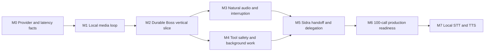

# Flexus Boss voice agent execution backlog

Status: M5 integration in progress; the completed voice frontend is ready for VA-507 full-stack proof
Last updated: 2026-09-02
Architecture source: [implementation plan](./implementation_plan.md)

## How to use this backlog

Create one Flexus Kanban project named `voice-agent`. Each `VA-*` row below becomes one task with one accountable owner, explicit blockers, and the listed evidence required for review. Keep future milestones in Inbox/Backlog; move only the next unblocked milestone into Todo.

Do not create one task named “implement voice agent.” The work crosses realtime media, provider APIs, the Flexus executor, conversation persistence, frontend audio, permissions, deployment, and operations. A task is complete only when its observable acceptance statement passes.

Relative sizes are planning aids, not calendar promises:

- `S`: narrow change or bounded experiment with one primary owner;
- `M`: multi-file feature with tests and one integration boundary;
- `L`: vertical slice or infrastructure capability that should be split during implementation if review becomes unsafe.

Every task description should contain:

```text
Objective
Why this is needed
In scope
Explicitly out of scope
Dependencies / blocked-by task IDs
Likely code and infrastructure areas
Acceptance criteria
Test or benchmark evidence
Metrics / logs added
Rollout and rollback notes
```

Recommended Kanban mapping:

```text
ktask_project = "voice-agent"
ktask_title = "[VA-xxx] concise outcome"
ktask_details = objective, scope, owner lane, size, acceptance, evidence
ktask_blocked_by_ids = durable task IDs corresponding to symbolic dependencies below
Todo = only the active milestone and explicitly unblocked work
InProgress = one primary task per owner unless a review is waiting
Review = code, benchmark artifact, or recorded demo attached
Done = acceptance statement verified, not merely code written
```

## Delivery strategy

The critical path is prototype-first:



The provider spikes, local LiveKit setup, browser client, and worker skeleton may progress in parallel after `VA-001`. Schema work begins after the local loop proves the contracts. Handoff and delegation do not block the first useful Boss prototype.

## Milestone gates

| Milestone | Demonstrable outcome | Gate to continue |
| --- | --- | --- |
| M0 | real OpenRouter STT/TTS measurements and stable adapter contracts | provisional providers and latency budget selected |
| M1 | one browser talks through local LiveKit and hears synthesized audio | no LiveKit Cloud endpoints; cancellation and basic concurrency measured |
| M2 | one durable Boss conversation works by voice and remains usable as text chat | one utterance, one message, one run; direct executor path proven |
| M3 | speaker echo is controlled and genuine/false interruptions behave naturally | barge-in and false-resume latency gates pass on supported clients |
| M4 | foreground tools, confirmations, and background operations preserve Flexus safety | speech interruption never corrupts or silently changes a tool outcome |
| M5 | Boss can call Sidra, return, or delegate work with separate conversations | handoff/delegation permission and idempotency tests pass |
| M6 | the system admits, operates, drains, and observes a measured 100-call target | production load, failure, security, and rollback gates pass |
| M7 | approved workspaces can use local speech providers without contract changes | local quality/capacity meets the external baseline and rollback is immediate |

## M0 — Provider contracts and measurement foundation

Likely areas: `setup.py`, `flexus_backend/experiments/voice_streaming/`, new provider-adapter modules, benchmark fixtures, and documentation.

| ID | Task | Owner lane | Size | Depends on | Done when |
| --- | --- | --- | --- | --- | --- |
| VA-001 | Pin the prototype contracts and dependency versions | Voice platform | S | — | LiveKit server/SDK, OpenRouter endpoints, PCM format, sample rate, cancellation, IDs, and environment variables are written as versioned contracts; runtime contains no LiveKit Cloud URL |
| VA-002 | Build and benchmark the OpenRouter utterance STT adapter | Speech/runtime | M | VA-001 | real short/long/noisy English and required-language utterances produce normalized final events with p50/p95/p99, errors, usage, and cost artifacts |
| VA-003 | Build and benchmark incremental PCM TTS with two voices | Speech/runtime | M | VA-001 | first-byte timing, chunk consumption, cancellation, audio duration, and Boss/Sidra voice candidates are measured without waiting for a complete MP3 |
| VA-004 | Define the common latency trace and synthetic-call harness | Observability/QA | M | VA-001 | a machine-readable result schema correlates utterance, STT, run, phrase, TTS, playout, cancellation, and concurrency metrics across later milestones |

M0 exit review:

- Select provisional STT/TTS providers and voices.
- Record rejected candidates and reasons.
- Freeze adapter interfaces, not provider model names.
- Do not begin durable schema migration if the real provider loop cannot meet a plausible latency budget.

## M1 — Local LiveKit media loop

Likely areas: `compose.yml` or a companion voice compose file, `setup.py`, `flexus_frontend/package.json`, proposed `flexus_backend/services/service_voice_agent.py`, proposed `voice_agent/pipeline/`, and proposed `flexus_frontend/src/features/voice/`.

| ID | Task | Owner lane | Size | Depends on | Done when |
| --- | --- | --- | --- | --- | --- |
| VA-101 | Add pinned local `livekit-server` and isolated development configuration | Platform | M | VA-001 | a developer can start local signaling/RTC/TURN-required paths with documented ports, keys, Redis isolation, health checks, and zero Cloud dependency |
| VA-102 | Implement a prototype token and explicit-dispatch control path | Backend/API | M | VA-101 | an authenticated development caller receives a short-lived room-scoped token and the generic worker receives only signed opaque job metadata |
| VA-103 | Add the realtime browser room client and capture settings | Frontend | M | VA-101 | browser joins/leaves, publishes microphone continuously, plays the agent track, enables supported AEC/NS/AGC, and exposes effective/degraded device state |
| VA-104 | Add the generic voice-worker entry point and per-call actor skeleton | Voice runtime | M | VA-101 | one dispatched room owns one isolated actor with lifecycle, cancellation scope, bounded initialization, and structured IDs; no agent-specific worker exists |
| VA-105 | Complete microphone -> VAD -> STT -> echo text -> TTS -> room | Voice runtime | L | VA-002, VA-003, VA-102, VA-103, VA-104 | a local user speaks naturally and hears synthesized echo text with recorded EOU/STT/TTS/playout timings |
| VA-106 | Add stream cancellation, stale-frame rejection, and initial concurrency baseline | Voice runtime/QA | M | VA-004, VA-105 | stopping one speech invalidates queued output by `turn_id`/`speech_id`; 1/5/10/20-call results show no cross-room audio or state leakage |

M1 exit review:

- Record a demo and benchmark artifact.
- Confirm that the existing `useAudioRecorder.ts` upload-oriented hook was not overloaded with realtime room responsibilities; the new voice client may reuse only safe helpers.
- Decide whether version 1 starts with desktop web only or includes Capacitor/mobile behavior.

## M2 — Durable Boss vertical slice

Likely areas: `prisma/schema/public.prisma`, a new Prisma migration, proposed `flexus_backend/flexus_v1/v1_voice.py`, `flexus_backend/flexus_v1/the_v1_router.py`, `flexus_backend/flexus_v1/v1_conversation_crud.py`, `flexus_backend/flexus_v1/v1_conversation_ops.py`, `flexus_backend/flexus_v1/v1_conversation_events.py`, `flexus_backend/langgraph_runtime/execution/run_executor.py`, `flexus_frontend/src/features/chat/chatApi.ts`, `flexus_frontend/src/features/chat/conversationSubscription.ts`, and the new voice frontend module.

| ID | Task | Owner lane | Size | Depends on | Done when |
| --- | --- | --- | --- | --- | --- |
| VA-201 | Add voice session, leg, and speech/playout schema with migration tests | Data/backend | L | M1 gate | session ownership, active leg, opaque room, reconnect state, speech status, and heard cutoff persist with indexes, relations, cleanup, and migration rehearsal |
| VA-202 | Add authorized GraphQL create/refresh/end voice-session mutations | Backend/API | M | VA-201 | mutations authenticate the human, authorize group/agent, apply quotas, mint minimal short-lived tokens, audit lifecycle changes, and are idempotent |
| VA-203 | Implement durable actor bootstrap, lease, close, and reconnect | Voice runtime | L | VA-104, VA-201, VA-202 | actor loads authoritative session data from `vsession_id`, renews a bounded lease, resumes the same leg after short disconnect, and closes without duplicating work |
| VA-204 | Persist one finalized voice transcript exactly once | Backend/runtime | M | VA-201, VA-203 | `(vsession_id, voice_utterance_id)` deduplicates retries and creates one normal human message with voice provenance and initiating-human identity |
| VA-205 | Bridge the actor directly to the existing `run_executor.execute_run` | Agent runtime | L | VA-204 | the live actor uses the same snapshot, tool policy, RequestContext, checkpoint, messages, and finish semantics as ARQ without entering the shared ARQ queue |
| VA-206 | Convert safe LangGraph events into ordered speech segments and TTS | Voice runtime | L | VA-003, VA-205 | only user-facing post-tool text is segmented; Markdown/tool data is suppressed; assistant persistence remains owned by the existing executor |
| VA-207 | Add Boss call UI, states, transcript synchronization, and reconnect | Frontend | L | VA-202, VA-203, VA-206 | chat shows active agent, listening/transcribing/thinking/speaking/error states, durable messages, recoverable connection state, and text-chat continuity after call end |
| VA-208 | Prove the durable Boss vertical slice end to end | QA/full stack | M | VA-204, VA-205, VA-206, VA-207 | five voice turns create five user messages and at most five runs, survive page reconnect, and render the same durable conversation in ordinary chat |

M2 exit review:

- Verify direct execution latency against the M0/M1 baseline.
- Confirm the voice actor is orchestration, not a second source of tool, memory, or message truth.
- Freeze the control/data contracts needed by M3–M5.

## M3 — Natural audio, bounded streams, and interruption

Likely areas: the new frontend voice capture/playout module, new voice actor queue/state modules, speech playout persistence, metrics, and audio corpus tests.

| ID | Task | Owner lane | Size | Depends on | Done when |
| --- | --- | --- | --- | --- | --- |
| VA-301 | Establish the supported-client AEC/NS/AGC compatibility matrix | Frontend/QA | M | VA-103, VA-208 | desktop Chrome reports effective processing and passes three built-in speaker/microphone trials; headphone control, Safari, Firefox, and mobile clients are explicitly deferred |
| VA-302 | Implement bounded text, TTS, PCM, and RTC queues with backpressure | Voice runtime | M | VA-206 | every queue has item/age limits, ordered playout, cancellation propagation, stale-output rejection, and pressure metrics without unbounded memory growth |
| VA-303 | Implement two-phase VAD barge-in and false-interruption resume | Voice runtime | L | VA-301, VA-302 | probable speech pauses output quickly; genuine speech commits cancellation; cough/click/empty STT resumes without a phantom user message |
| VA-304 | Persist and reconcile speech playout cutoff | Data/runtime | M | VA-201, VA-303 | completed/interrupted speech records generated versus played duration and best known text cutoff without duplicating assistant content |
| VA-305 | Tune interruption thresholds with an echo/noise/backchannel corpus | QA/observability | M | VA-004, VA-303, VA-304 | threshold sweep reports true/false interruption rates and p50/p95/p99 pause/resume latency; selected values and client exceptions are documented |

M3 exit review:

- Meet the initial barge-in target on supported clients.
- Demonstrate genuine interruption, “uh-huh”/backchannel, cough, keyboard noise, and speaker echo.
- Confirm no LiveKit Cloud adaptive interruption or enhanced cancellation runtime dependency.

## M4 — Tool calling, confirmations, and background work

Likely areas: `flexus_backend/langgraph_runtime/execution/run_executor.py`, tool resolution/policy modules, `flexus_backend/langgraph_runtime/tools/core/confirmation.py`, `flexus_frontend/src/features/chat/ChatConfirmationRequests.tsx`, `confirmationResume.ts`, conversation events, and integration-specific wrappers.

| ID | Task | Owner lane | Size | Depends on | Done when |
| --- | --- | --- | --- | --- | --- |
| VA-401 | Bridge structured foreground-tool activity into voice state | Agent/voice runtime | M | VA-205, VA-206 | real tool events produce safe UI activity and at most one concise spoken acknowledgement; raw arguments/results/secrets are never spoken |
| VA-402 | Add voice confirmation prompt and resume bridge | Agent runtime/frontend | L | VA-207, VA-401 | ordinary chat retains the signed detailed card, voice UI/speech remain generic, explicit approve/reject resumes the same interrupt, and silence or barge-in never approves |
| VA-403 | Define tool cancellation and idempotent outcome policy | Agent runtime | M | VA-303, VA-401 | tools declare cancellability/background/side-effect behavior; speech stop differs from explicit operation cancel; late results are correlated by `turn_id` |
| VA-404 | Add integration bulkheads and durable background-operation contract | Runtime/platform | L | VA-403 | per-tool/provider limits, deadlines, circuit breakers, metrics, and durable operation IDs prevent slow work or quotas from blocking audio handling |
| VA-405 | Prove the foreground/confirmation/background tool matrix | QA/full stack | M | VA-402, VA-403, VA-404 | read-only, confirmation-required, committed side-effect, slow background, interruption, retry, and provider-limit scenarios report truthful outcomes |

M4 exit review:

- Audit that no voice-only business tool bypasses Flexus policy.
- Confirm long/retryable work leaves the live conversation responsive.
- Classify the initial Boss tool allowlist as foreground, confirmation, or background.

## M5 — Agent voices, live Sidra handoff, and Boss delegation

Likely areas: `prisma/schema/public.prisma`, predefined agent YAML/snapshot refresh, voice session legs, a voice-only capability module, new `boss_delegate` tool, `flexus_backend/services/service_scheduler.py`, `service_langgraph_arq_worker.py`, and frontend handoff UI.

| ID | Task | Owner lane | Size | Depends on | Done when |
| --- | --- | --- | --- | --- | --- |
| VA-501 | Add stable agent voice profiles and deterministic fallback | Data/agent config | M | VA-003, VA-201 | Boss and Sidra have persisted/provider-independent profiles with instance, blueprint, workspace, and global fallback behavior |
| VA-502 | Implement authorized voice-only `voice_call_agent` capability | Agent/voice runtime | L | VA-205, VA-405, VA-501 | capability exists only in a valid voice context and validates target, workspace/group, human access, expert, pending confirmation, and bounded summary |
| VA-503 | Implement durable conversation legs and same-room handoff coordinator | Voice runtime/data | L | VA-202, VA-502 | first Sidra call creates one Sidra conversation, later calls resume it, the active leg commits atomically, and WebRTC does not reconnect |
| VA-504 | Add global “Boss, come back” routing and safe return context | Voice runtime | M | VA-503 | command works even when Sidra lacks a routing tool, restores the original Boss conversation/voice, and passes only bounded provenance-aware context |
| VA-505 | Add active-agent and handoff states to the call UI | Frontend | M | VA-503, VA-504 | name/avatar/voice state switch only at the committed boundary; failure leaves Boss visible and active; stale PCM from the old leg is rejected |
| VA-506 | Implement active `boss_delegate` durable task contract | Agent/runtime | L | VA-405 | Boss atomically validates target and creates one target-assigned Todo task with human/Boss/voice provenance and idempotency, then returns its task ID |
| VA-507 | Prove Boss/Sidra handoff, return, delegation, and permission boundaries | QA/full stack | L | VA-503, VA-504, VA-505, VA-506 | Boss->Sidra->Boss, repeated switches, “ask Sidra,” call-about-task, disabled/cross-workspace targets, reconnect, and duplicate retries all pass |

M5 exit review:

- Confirm direct Sidra turns live only in Sidra’s conversation.
- Confirm delegation runs through scheduler/ARQ and survives call termination.
- Confirm group/conference communication remains explicitly out of scope.

## M6 — Capacity, reliability, security, and rollout

Likely areas: voice API/worker capacity leases, Redis, deployment manifests, Prometheus/OpenTelemetry, load tooling, feature flags, security/audit code, and runbooks.

| ID | Task | Owner lane | Size | Depends on | Done when |
| --- | --- | --- | --- | --- | --- |
| VA-601 | Implement atomic realtime-slot admission and worker capacity advertisement | Platform/backend | L | VA-203, M5 gate | create-session reserves exactly one slot, over-capacity fails before room admission, and workers publish max/active/available slots |
| VA-602 | Add warm-pool autoscaling, readiness, graceful drain, and rollout controls | Platform/SRE | L | VA-601 | scale-up uses available slots plus CPU/memory/latency; scale-down removes readiness, drains active calls, and never kills a healthy call silently |
| VA-603 | Build and run the 50/100-room load and soak suite | Performance/QA | L | VA-004, VA-302, VA-404, VA-601 | results cover simultaneous EOU, TTS, barge-in, tools, TURN/direct UDP, 30/60-minute soak, errors, costs, and safe sessions per pod |
| VA-604 | Implement worker crash, reconnect, Redis-event-loss, and idempotent recovery | Runtime/platform | L | VA-203, VA-304, VA-601 | committed utterances/runs/handoffs/delegations are not duplicated; durable conversations survive; bounded reconnect or explicit failure is visible |
| VA-605 | Add provider fallback and explicit degraded-to-text behavior | Voice runtime/frontend | M | VA-002, VA-003, VA-207 | STT/TTS/LLM/provider timeout and rate-limit policies are bounded, audited, and never silently route to an unapproved provider |
| VA-606 | Complete privacy, authorization, abuse, and audit review | Security | L | VA-507, VA-604, VA-605 | tokens/secrets stay server-side, audio is not recorded by default, provider data flow is disclosed, quotas apply, and cross-workspace attempts fail closed |
| VA-607 | Add workspace feature flags, staged rollout, dashboards, alerts, and rollback runbook | Product/SRE | M | VA-602, VA-603, VA-606 | developers/pilots can be enabled independently; rollback stops new calls and drains existing calls without deleting durable work |

M6 exit review:

- Publish `raw_sessions_per_pod`, safe utilization, warm spare, and media-node capacity assumptions.
- Pass the full acceptance list in the implementation plan.
- Require explicit sign-off for pilot provider retention/routing and supported client platforms.

## M7 — Future local STT and TTS

This milestone begins only after the OpenRouter baseline is stable enough to compare against.

| ID | Task | Owner lane | Size | Depends on | Done when |
| --- | --- | --- | --- | --- | --- |
| VA-701 | Deploy a shared local streaming STT adapter and shadow evaluation | Speech platform | L | M6 gate | partial/final events implement the stable contract and shadow WER/entity/latency/capacity results beat or match the approved threshold |
| VA-702 | Deploy a shared local streaming TTS adapter and voice evaluation | Speech platform | L | M6 gate | PCM contract, cancellation, first-byte latency, voice consistency, multilingual quality, and capacity meet the selected baseline |
| VA-703 | Add per-workspace cutover, cost/capacity controls, and immediate rollback | Platform/product | M | VA-701, VA-702 | external audio routing can be disabled workspace by workspace without changing conversations, sessions, or agent voice identity |

## Initial Ready queue

After backlog approval, begin with these tasks:

| Order | Task | Parallelism |
| ---: | --- | --- |
| 1 | VA-001 Pin contracts and versions | first task; unblocks all prototype lanes |
| 2 | VA-002 OpenRouter STT spike | parallel with VA-003 and VA-101 |
| 3 | VA-003 OpenRouter PCM TTS spike | parallel with VA-002 and VA-101 |
| 4 | VA-101 Local LiveKit compose/config | parallel with provider spikes |
| 5 | VA-004 Latency trace and harness | starts after VA-001; parallel with provider work |
| 6 | VA-103 Browser room client | starts after VA-101 |
| 7 | VA-104 Voice-worker actor skeleton | starts after VA-101, parallel with VA-103 |
| 8 | VA-105 End-to-end local loop | integration point after provider/client/worker prerequisites |
| 9 | VA-106 Cancellation and concurrency baseline | M1 gate evidence |
| 10 | VA-201 Durable voice session, leg, and playout schema | first M2 foundation; complete before VA-202 |
| 11 | VA-202 Authorized idempotent voice-session mutations | complete before VA-203 actor bootstrap |
| 12 | VA-203 Durable actor bootstrap, fenced lease, close, and reconnect | complete before VA-204 transcript persistence |
| 13 | VA-204 Exactly-once finalized voice transcript persistence | complete before VA-205 direct executor bridge |
| 14 | VA-205 Direct warm-actor executor bridge | complete before VA-206 safe response speech |
| 15 | VA-206 Safe terminal response segmentation and ordered TTS | complete before VA-207 call UI synchronization |
| 16 | VA-207 Boss call UI, durable transcript synchronization, and reconnect | complete before VA-208 vertical-slice proof |
| 17 | VA-208 Durable Boss vertical-slice end-to-end proof | complete; M2 evidence recorded |
| 18 | VA-301 Supported-client AEC/NS/AGC compatibility matrix | complete for approved Chrome-only scope; headphone control explicitly deferred |
| 19 | VA-302 Bounded text, TTS, PCM, and RTC queues | complete |
| 20 | VA-401 Safe foreground-tool activity bridge | complete |
| 21 | VA-402 Signed confirmation prompt and same-interrupt resume bridge | complete |
| 22 | VA-501 Stable provider-independent agent voice profiles | complete; satisfies one VA-502 prerequisite |
| 23 | VA-403 Tool cancellation and idempotent late-outcome policy | complete |
| 24 | VA-404 Integration bulkheads and durable background-operation contract | complete |
| 25 | VA-405 Foreground, confirmation, and background tool matrix | complete; M4 evidence recorded |
| 26 | VA-502 Authorized voice-only agent-call capability | complete |
| 27 | VA-503 Durable conversation legs and same-room handoff | complete |
| 28 | VA-504 Global return routing and bounded context | complete |
| 29 | VA-505 Active-agent UI and committed presentation scope | complete; reconnect and degraded-to-chat paths included |
| 30 | VA-506 Durable Boss delegation task contract | complete |
| 31 | VA-605 Approved-provider policy and explicit degraded state | complete |
| 32 | VA-507 Boss/Sidra handoff, return, delegation, and permission proof | next incomplete dependency-valid task |

VA-201 started only after VA-105 and VA-106 established the local media, cancellation, and
isolation contracts. VA-202 provides the authorized lifecycle surface, durable retry key,
dispatch reconciliation, quota enforcement, token refresh, and idempotent end. VA-203 adds
authoritative actor bootstrap, a token-fenced Redis lease plus durable actor epoch,
participant-scoped durable liveness, and bounded same-leg reconnect. VA-204 stores the finalized
transcript as the ordinary user message and returns its durable reference without entering ARQ.
VA-205 starts the existing executor directly only for the first visible insert, reuses its full
snapshot/tool/context/checkpoint semantics, serializes voice versus ARQ claims, and preserves ARQ
only for queued follow-up recovery. VA-206 exposes only terminal unqueued completions, selects the
last safe post-human assistant response, strips non-speech/tool/reasoning material, and plays
bounded TTS phrases in one continuous ordered speech sequence. Barge-in also cancels Boss while
the executor is still thinking. VA-207 adds the in-chat Boss call control, a private versioned
ephemeral state channel, ordinary durable message synchronization, and same-session recovery.
VA-208 proves five distinct voice turns become five ordinary durable human messages and five
direct-run-eligible results, alongside five independently successful production run-gate claims.
VA-205's service tests prove that only a newly inserted eligible result enters the executor.
Replaying the first utterance creates neither another message nor another run candidate. The same
session and participant refresh after a page remount, the same leg and conversation resume after
disconnect, and voice-provenance content renders in the ordinary chat timeline. The next
dependency-ordered task is VA-301 client audio-processing compatibility evidence.

VA-301 now has a privacy-safe effective-settings report and a local physical AEC comparison. The
initial pilot is desktop Chrome only. Three built-in speaker/microphone trials passed, so the matrix
is complete for the approved initial scope. The headphone weak-coupling control is explicitly
deferred and is not claimed as passed. Safari and Firefox compatibility, including Safari's missing
processing-isolation evidence, is deferred to a later expansion. iOS and Android also require
separate physical-device evidence before a later pilot can include them.

VA-302 now bounds all four output stages. Text, TTS-request, PCM, and RTC queues have explicit
item and age ceilings, strict FIFO sequencing, turn/speech ownership, cancellation flushes, stale
and expired rejection, and content-free pressure metrics. Provider PCM has independent raw-chunk
and total-response ceilings. A blocked LiveKit capture is deadline-bound and permanently fences
the affected sink instance.

VA-303 implements the local two-phase interruption policy. Probable speech pauses Flexus-owned
playout after 100 ms. Candidates reaching 250 ms receive one bounded STT classification; nonblank
speech commits cancellation and starts one replacement turn, while short noise, empty STT, STT
failure, and timeout resume the exact owned speech without a durable user message. LiveKit Cloud
adaptive interruption is not used. VA-304 is next.

VA-304 activates the existing durable speech/playout schema without another migration. Executor
completion carries the exact assistant message sequence selected for safe speech. The actor writes
one fenced `PLAYING` record before audio and one idempotent terminal outcome with generated versus
LiveKit-accepted duration and a conservative completed-segment text boundary. It never duplicates
assistant content or guesses a message by recency. VA-305 is next.

VA-305 sweeps 150/250/350/500 ms against 17 deterministic genuine-interruption, click, cough,
keyboard, echo-leak, empty/error/timeout STT, and English/Russian backchannel cases. The selected
100 ms probable pause plus 250 ms commit threshold produced 100% genuine-case commit recall and
zero false commits in this offline corpus; pause and resume sink acknowledgements were 100 ms and
0 ms at p50/p95/p99. Full recovery after speech still includes the 600 ms trailing-silence window
and bounded STT time. The artifact explicitly does not claim physical audio or RTC measurement.
Desktop Chrome with built-in speaker/microphone remains the only initial supported path; headphone,
Safari, Firefox, and mobile evidence is deferred.

VA-401 projects real executor tool-call and result updates into one boolean aggregate without
forwarding the ordinary activity payload. Opaque call IDs stay executor-internal for duplicate and
parallel-call accounting. A server-owned foreground policy fail-closes unknown, background,
confirmation-gated, and mutating operations. Observer failure cannot alter the durable run. The
owned voice turn moves between `THINKING` and `TOOL_ACTIVE`, and the
browser renders only the localized generic label. Protocol tools are ignored, unfinished activity
clears on every executor exit, and stale-turn callbacks cannot revive state. Version 1 speaks no
tool-activity filler; the normal safe final assistant response remains the only tool-result speech.

VA-402 announces a confirmation only after the existing signed interrupt is durably stored and
disables standing automatic approval on voice runs. The call enters
`WAITING_FOR_CONFIRMATION`, speaks fixed server-owned copy, and recognizes only exact multilingual
approve/reject phrases; ambiguity reprompts, while silence and barge-in never decide. Spoken
resolution reauthorizes the actor epoch and active leg under lock, retrieves the token only from
the stored exact interrupt, preserves any other pending resume, writes the native continuation,
audits without sensitive fields, and resumes the same checkpoint directly. The generic call card
reuses the ordinary authorized mutation while the detailed card stays in chat. Web decisions keep
their ARQ continuation; a connection-free actor-fenced phase probe prevents double execution and
releases or fails the local call deterministically. Reconnect preserves a genuinely pending wait.

VA-501 persists only semantic voice profile keys. The initial leg freezes the resolved
instance-to-blueprint-to-workspace-to-global selection transactionally, so reconnect cannot change
an active actor's voice. Boss uses `voice_boss` and Sidra uses `voice_sidra`; the server registry
currently maps them to distinct measured OpenRouter voices while keeping provider details out of
agent and workspace records. Authenticated agent/workspace patches accept registered keys and use
an explicit empty-string clear-to-inherit contract. Blueprint refresh leaves instance overrides
untouched. M3 is complete for the explicitly bounded initial Chrome pilot scope.

VA-403 classifies every initial Boss tool operation as foreground, confirmation, or background;
read-only or committing; and cancellable or non-cancellable. Unknown operations fail closed.
Voice direct runs are call-scoped and shielded from turn cancellation, so barge-in stops only stale
presentation while tool work reaches its durable boundary. Explicit operation cancellation uses an
idempotent request ID and refuses any run containing committed, background, unknown, or parallel
non-cancellable work. Safe start and terminal outcomes contain the originating `turn_id`, opaque
activity ID, tool name, phase, and policy only; duplicate and stale outcomes cannot revive voice
state.

VA-404 adds integration bulkheads as a third bind-time wrapper after policy and activity title, keyed
on the integration registry so provider identity is derived rather than duplicated. External
integrations get bounded concurrency, a bounded queue wait that rejects without running the call, a
circuit breaker, and read-only-only retry; the shared internal pool runs wider with the breaker
disabled. The wrapper is outermost so the existing activity-title deadline starts only after a slot
is acquired. One bulkhead serves every run because the M4 gate forbids a parallel voice-only tool
path; bulkheads are per worker process, and a globally shared provider quota remains VA-601 work.
Background-declared operations mint a deterministic durable operation ID usable as an ARQ `_job_id`,
and unknown operations never receive one.

VA-405 proves the matrix as one suite rather than more unit tests, asserting the full truth per
operation class across policy, bulkhead, and voice runtime together: classification, cancellability,
retryability, durable background identity, and voice-foreground activity. Retry is proved by call
count, and the undeclared class asserts every fail-closed axis in one test so no single axis can
regress silently. Provider-limit rejections are proved not to run the refused body and not to corrupt
voice cancel state. M4 is complete; its exit review is recorded in
`docs/feature-voice-agent/dev_log/va405_iteration_22.md`.

VA-506 adds an active `boss_delegate` tool, not voice-only logic. It validates the target agent
inside one transaction under the target group's advisory lock and fails closed with zero inserts on a
cross-workspace, disabled, or archived target. Idempotency reuses VA-404's deterministic operation ID
stored in task provenance, so a repeat returns the same task instead of a second one. The task is
inserted straight into Todo, which the existing pickup trigger already wakes the scheduler on, so no
migration and no new table were needed. `kanban_ops.py` was at its size ceiling, so the contract went
into a sibling module and five helpers were promoted rather than imported privately.

VA-502 adds the voice-only `voice_call_agent` capability. Injection mirrors the existing messenger
capture pattern, but injection alone is not the boundary: `app_capture` stays `"voice"` on a later
background run of the same conversation, so the tool independently requires an active, accepted,
unended leg whose agent matches the caller before it authorizes anything. Cross-workspace and
unrelated-group targets, disabled or archived agents, unknown experts, pending confirmations, and
unbounded summaries all fail closed. The capability authorizes only; the leg commit and conversation
switch are VA-503. Unlike the messenger overlay, an explicit workspace denial of `voice_call_agent` is
respected — voice handoff is optional, so nothing breaks by honouring it.

VA-605 makes provider routing fail closed. The approved provider/model allowlist is declared
independently of the voice profile registry, because deriving it from the registry that selects the
provider would approve whatever it was handed. Bounded retry and the breaker reuse VA-404's bulkhead;
timeout, rate limit, and provider error stay three distinct audited outcomes. It closed a real
pre-existing hole: `FLEXUS_VOICE_STT_MODEL` reached the STT request unvalidated.

VA-503 commits a live agent switch as one durable transaction under a `FOR UPDATE` lock on the joined
session and active-leg row, which is what makes a duplicate safe rather than an application-level
check two racing callers could both pass. One symmetric operation serves both directions; a duplicate
whose target already holds the active leg returns idempotently and writes nothing. A stale actor epoch
refuses. The session's `located_fgroup_id` moves with the active leg, without which a cross-group
handoff leaves the actor unable to reload its own session. The scoped context item carries only the
source agent, conversation, group, bounded summary, and expert name — never the source system prompt
or history — and its exact key set is asserted. No production call site exists yet: the commit belongs
to the call actor, sequenced after the outgoing sentence drains and immediately before the LiveKit
switch, which is VA-504 and VA-505.

VA-504 classifies the return command in `commit_finalized_transcript` before transcript persistence
and before any executor dispatch. That position is the requirement rather than an optimisation: a
routing tool the specialist chooses to call cannot satisfy "works even when Sidra lacks a routing
tool". A match creates no user message in the specialist's conversation and starts no run, and the
runtime tests construct the call with no registry, checkpointer, or ARQ pool to prove it needs none of
the specialist's machinery. The command requires an explicit reference to the originating agent, since
unlike the confirmation classifier it runs on every utterance; "tell Boss later" and "come back later"
fall through as ordinary input. Saying it to the originating agent is a no-op, and a nested chain
returns straight to the first leg rather than unwinding one level at a time. It is VA-503's first
production caller. The LiveKit rebind remains unwired, so one turn's trace attribution stays with the
specialist while the caller already hears the originating agent's voice; VA-505 resolves that.

VA-505 makes the call UI switch identity only when a state packet arrives for a higher `vleg_seq`, and
discard anything from a lower one. Those are the same invariant, not two features: `vleg_seq`
increments only when `voice_leg_ops` commits, and it is the only per-leg signal the browser sees —
there is no separate PCM channel, since a session is one continuous LiveKit track and backend audio
staleness is already gated by turn and generation checks. The decision lives in a pure, directly
unit-tested module. It also fixed a bug that made the feature unreachable: packet validation compared
leg, agent, and conversation against the identity captured at join, so every second-leg packet was
rejected as a protocol error.

That seam is now closed. The publisher is registered on the actor rather than held only by the LiveKit
call object, and its publish callback carries no leg identity, so `_apply_voice_return` rebinds it
through the actor without touching the SDK. `rebind_leg` moves the identity, restarts `vstate_seq` at
zero as the frontend expects, and clears pending states — without that last step a state queued for the
old leg would be published under the new agent's identity. A committed return now emits the new
`vleg_seq`, which is the signal VA-505's UI switches on, so the durable switch and the wire signal
finally agree.

What remains unwired is the LiveKit `AgentSession.update_agent` call itself. The voice profile is read
fresh per turn, so the caller already hears the new agent; the SDK rebind and a real end-to-end call
against live LiveKit and OpenRouter are what VA-507 still needs, and neither can run in the unit tier
because the media stack is deliberately excluded from CI.

VA-507 is the next incomplete dependency-valid task.

## Review cadence and evidence

At each milestone review, attach:

- exact commit and pinned dependency versions;
- test command and result;
- benchmark JSON plus a concise Markdown interpretation;
- p50/p95/p99 rather than averages alone;
- screenshots or recording only when they add evidence and contain no sensitive customer audio;
- unresolved risks and the task IDs that own them;
- explicit gate decision: pass, repeat, or stop.

Keep one decision log entry in the architecture plan when a prototype changes a settled assumption. Do not silently edit thresholds or provider choices without preserving the evidence and reason.

## Backlog management rules

1. One primary owner per task; collaborators are named in task details.
2. A blocked task remains out of InProgress unless useful independent work is identified.
3. Limit work in progress before opening more parallel infrastructure threads.
4. Prefer one vertical PR per task; split any `L` task if schema, API, runtime, frontend, and deployment changes cannot be reviewed safely together.
5. Prototype-only code stays isolated and clearly marked until its milestone gate passes.
6. Database migrations receive rehearsal and rollback evidence before review.
7. Provider-backed tests require explicit markers and cost limits; ordinary unit suites remain offline.
8. Load tests use synthetic participants and generated audio, never customer recordings by default.
9. Any scope change affecting local-only media, ARQ separation, conversation ownership, or one-active-agent behavior requires architecture review before implementation continues.
10. Group/conference communication remains a separate future initiative and must not leak into these tickets.
